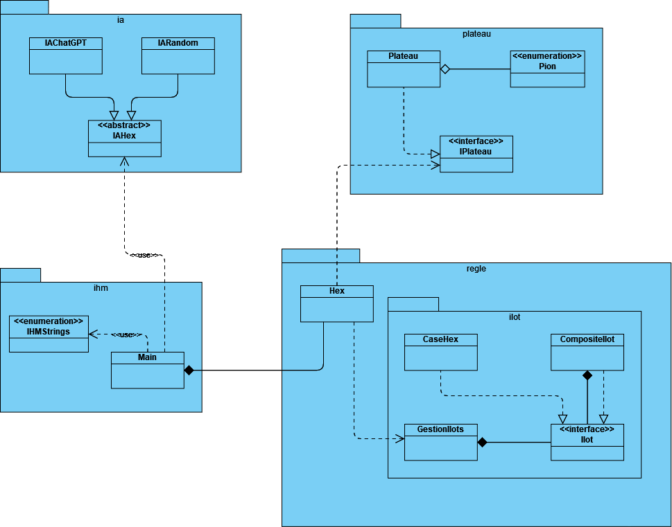

# 
 _Dossier de développement_   <ins> Projet Hex </ins> 

### 
 Qualité de développement 

### 
 Groupe 203 / 204

Par  
Etienne Kita  
Tony Zheng  
Patrick Wu  
Steven Tea  

 Décembre 2022 

## Table des matières

1. [Introduction](#intro)
2. [Diagramme d'architechture](#archi)
3. [Ce qui a été testé par les tests unitaires](#testsU)
4. [Tâches à accomplir pour modifier certaines règles](#modif)
5. [Bilan du projet](#bilan)
    1. Difficultés rencontrées
    2. Ce qui est réussi
    3. Ce qui peut être amélioré

## <ins> 
I - Introduction
 </ins>
&ensp;&ensp;&ensp;&ensp; Globalement, nous avons pu réussir à intégrer et faire fonctionner pratiquement tout ce qui a été demandé. Cependant, il nous n'avons pas pu d'intégrer une interface Homme-Machine avec une interface graphique. Nous comptions à la base voulu le faire avec la biliothèque graphique JFrame, mais par faute de temps à cause d'autres projets et l'apprentissage de la bibliothèque, nous avions malheureusement pas eu le temps de l'intégrer.

## <ins> 
II - Diagramme d'architechture
 </ins>

## <ins> 
III - Ce qui a été testé par les tests unitaires
 </ins>
&ensp;&ensp;&ensp;&ensp; Plusieurs classes ont été testées avec les tests unitaires de JUnit.
Les classes testées sont :
* L'énumération Pion
    * Les méthodes toString() et get() ont été testées et validées
* La classe Hex
    * Les méthodes estValide(), jouerCoup(), getPlateau() et toString() ont été testées et validées
* La classe Plateau
    * Les méthodes taille(), jouer(), getCase(), toString(), decouper() et getTaille() ont été testées et validées
* Les classes d'IA et l'interface IAHex
    * La méthode getCoup() pour les deux types d'IA et la méthode checkWin() ont été testées et validées

## <ins> 
IV - Tâches à accomplir pour modifier certaines règles
 </ins>
&ensp;&ensp;&ensp;&ensp; Certaines options peuvent être ajouter en faisait certaines intéractions à des moments très spécifiques.

Nous pouvons faire jouer des ordinateurs plus ou moins fortes. Pour faire jouer une IA au lieu d'un joueur humain, lorsque nous devons entrer le nom d'un des joueurs, nous saisissons un chiffre au lieu d'une chaine de caractères. Nous avons également développé deux niveaux de difficultés d'IA :
1. En saisissant "0" comme nom de joueur : une IA qui tire des coups aléatoires.
1. En saisissant "1" comme nom de joueur : une IA forte.

Ainsi, nous pouvons faire jouer un humain contre un humain, un humain contre un ordinateur et un ordinateur contre un ordinateur.

## <ins> 
V - Bilan du projet
 </ins>

### 1) Difficultés rencontrées
&ensp;&ensp;&ensp;&ensp; Lors du développement du jeu Hex, nous avons rencontré de nombreuses difficultés, par exemple, pour la méthode gagnant() de la classe Hex, permettant de vérifier qu'il y a une rangée est bien valide a été difficile à concevoir. En effet, contrairement au démineur, uniquement six cases du plateaux sont adjacentes à une case et l'affichage en "losange" du plateau rend l'interface moins clairement à débugger (nous avons eu du mal à savoir quelles cases étaient adjacentes ou non).

### 2) Ce qui est réussi
&ensp;&ensp;&ensp;&ensp; Afin de gérer les cases hexagonales, nous avons été assez fier d'avoir pu utiliser le design pattern Composite, que nous avons vu en cours, pour faire la gestion en lots de cases. De plus, grâce à cela, nous avons pu réussir à faire fonctionner la méthode gagnant() de la classe Hex. Nous avons également essayé du mieux que nous pouvons pour que notre programme respecte les principes SOLID.

### 3) Ce qui peut être amélioré
&ensp;&ensp;&ensp;&ensp; Pour ce projet, nous aurions pu ajouter développer une interface graphique pour le jeu et ainsi pouvoir choisir si l'utilisateur joue en mode console ou en mode graphique.
